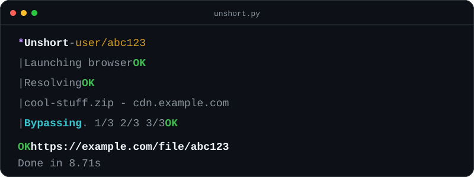

# Unshort


Unshort unwraps monetized shortlinks and prints the real destination URL. Minimal CLI, no browser extension, no compiled binary.



See the terminal preview above for sample output.

## Install

```bash
pip install -r requirements.txt
playwright install chromium
python unshort.py --help
```

## Usage

Drag `unshort.py` into your terminal after `python`, then paste the shortlink:

```bash
python unshort.py "https://linkvertise.com/ID/slug?o=sharing"
```

Quiet mode prints only the destination URL:

```bash
python unshort.py -q "https://linkvertise.com/..."
```

Use `--visible` if you want to watch the browser step.

## Supported shorteners

- Linkvertise
- More coming

## How it works

Unshort uses Playwright once to load the Linkvertise page and collect the same session cookies a real browser gets. It then reuses those cookies with `curl_cffi`, which sends Chrome-like TLS requests to Linkvertise's GraphQL API, resolves the link metadata, completes the required task flow, and returns the final destination URL.

## Coming soon

- lockr.so
- lootlabs
- work.ink

## License

MIT © xt0n1
